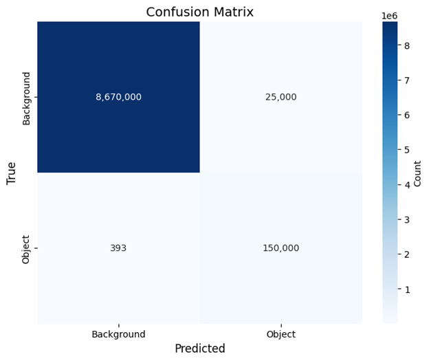
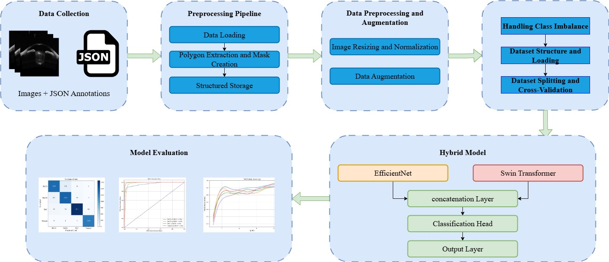

# Hybrid CNN-Transformer Model for Glaucoma Diagnosis from AS-OCT Images

## 📌 Abstract
This repository contains the official PyTorch implementation of the paper: **"Potential role of iris features for classification of angle closure glaucoma: insights from deep-learning-based analysis of AS-OCT scans and study of iris smoothness"**.

We propose a robust deep learning framework that combines **EfficientNet-B3** and **Swin Transformer** to classify Angle Closure Glaucoma subtypes (PACS, PAC, PACG) and Normal eyes. Additionally, a **U-Net** based segmentation module is employed for precise Iris Region of Interest (ROI) extraction to enhance model performance.

## 📊 Performance Results

Our proposed hybrid model achieved state-of-the-art results on the dataset, outperforming standalone CNN and Transformer models.

### 1. Classification Performance (Hybrid Model)
| Metric | Value |
| :--- | :---: |
| **Accuracy** | **92.88%** |
| **F1 Score** | **92.89%** |
| **ROC AUC** | **0.9844** |
| **Specificity** | **97.61%** |

*Detailed comparison with other models (EfficientNet, Swin Transformer, ResNet, ConvNeXt):*
| Model | Accuracy | F1 Score | AUC |
| :--- | :---: | :---: | :---: |
| **Hybrid (Ours)** | **0.9288** | **0.9289** | **0.9844** |
| EfficientNet-B3 | 0.8531 | 0.8541 | 0.9624 |
| Swin Transformer | 0.8481 | 0.8504 | 0.9753 |
| ConvNeXt | 0.8440 | 0.8440 | 0.9609 |

### 2. Segmentation Performance (U-Net)
The U-Net module successfully extracted the iris region with high precision, as shown in the confusion matrix.
| Metric | Value |
| :--- | :---: |
| **Dice Coefficient** | **0.9236** |
| **IoU Score** | **0.8581** |
| **Accuracy** | **99.31%** |



*Figure: Confusion matrix illustrating segmentation performance.*

## 🛠 Methodology
The diagnostic pipeline consists of two main stages:
1.  **Preprocessing & Segmentation:** Raw AS-OCT images are processed using a U-Net model to segment the iris and remove background noise.
2.  **Hybrid Classification:** The segmented images are fed into a dual-branch network. One branch (EfficientNet-B3) captures local textural features, while the other (Swin Transformer) captures global contextual dependencies. The features are fused for the final classification.


*Figure: The proposed preprocessing, augmentation, and classification pipeline.*

## 📂 Project Structure
```text
├── data/                  # Dataset folder (structure explained below)
├── models/                # Model architectures
│   ├── hybrid_model.py    # EfficientNet + Swin Transformer
│   └── unet_model.py      # U-Net for Segmentation
├── utils/                 # Helper scripts
│   ├── datasets.py        # Custom Dataset classes & Augmentations
│   └── metrics.py         # Evaluation metrics
├── results/               # Saved figures and logs
│   └── figures/           # Confusion matrices, ROC curves, diagrams
├── train_classifier.py    # Main script for training the hybrid model
├── train_segmentation.py  # Main script for training U-Net
├── requirements.txt       # List of dependencies
└── README.md              # Project documentation
```


## Getting Started
Prerequisites
Install the required dependencies 

Dataset Organization
Organize your data as follows:

Plaintext

/data
  /images
    /Patient_001.jpg
    ...
  labels.csv  (Columns: ImagePath, Label)
Usage
1. Train Segmentation Model (Optional): If you need to re-train the iris extraction module:

python train_segmentation.py --data_path "./data/images"
2. Train Classification Model: To train the hybrid model using K-Fold Cross-Validation:

python train_classifier.py --data_path "./data/images" --csv_path "./data/labels.csv" --epochs 25

##  📜 Citation
If you use this code or dataset in your research, please cite our paper:

